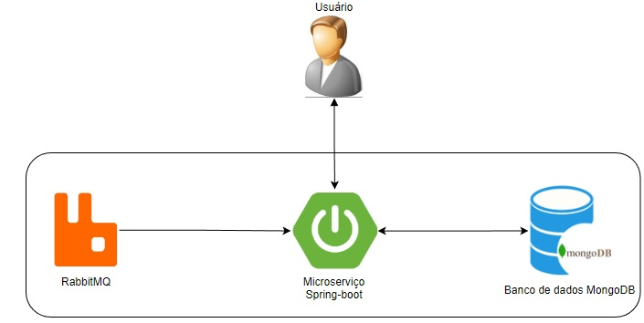
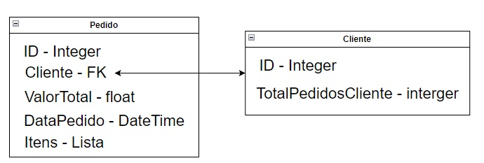

# GestorDePedidos

### Arquitetura:

### Banco de dados:

* Banco está separado em duas coleções, onde deixamos uma referência de cliente dentro do pedido.

### Código fonte:

[java](https://github.com/thimilo01/gestorDePedidos)

[docker img mongo](https://hub.docker.com/repository/docker/thimilo01/mongodb/general)

[docker img mongoexpress](https://hub.docker.com/repository/docker/thimilo01/mongoexpress/general)

[docker img rabbitMQ](https://hub.docker.com/repository/docker/thimilo01/rabbitmq/general)

Obs: Os docker também estão localizados no caminho ("/gestorDePedidos/src/main/resources/docker") dentro do projeto.

### Configurações iniciais:

[Docker windows](https://learn.microsoft.com/pt-br/virtualization/windowscontainers/manage-docker/configure-docker-daemon)

[Docker linux](https://docs.docker.com/desktop/install/linux-install/)

[Java 17](https://openjdk.org/projects/jdk/17/)

Após instalação e configuração será necessário subir as imagens docker's

### Configurações link's:

[RabbitMQ local](http://localhost:15672/#/)

[Mongoexpress local](http://localhost:8083)

[Swagger local](http://localhost:8080/swagger-ui/index.html#/)

## Technologies

* [Spring Boot](https://spring.io/projects/spring-boot)
* [Swagger](https://swagger.io/)
* [RabbitMQ](https://www.rabbitmq.com)
* [MongoDB](https://www.mongodb.com)
